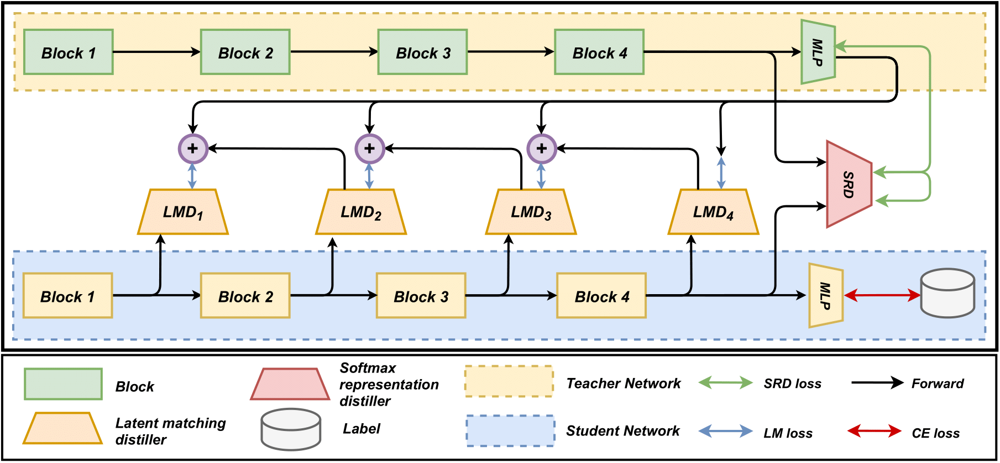

# Marrying the Best of Both Knowledge: Ensemble-based Latent Matching with Softmax Representation Knowledge Distillation.

## Overview of our framework.



## Dataset
The datasets for our method can be downloaded in Torchvision, and shell file, which is created by us. 
- CIFAR-10
- CIFAR-100
- Tiny ImageNet
- Facial Key-points

```
# CIFAR-100 will be downloaded automatically when you run demo.py 
cd ..
# https://www.kaggle.com/c/facial-keypoints-detection/overview
```


## Download pre-trained model weights
The pretrained weights can be downloaded by running the file in dataset.

```
# Download the pre-trained baseline weights
cd download_weight
sh download_baseline.sh
cd ..

# Download the pre-trained LSKD weights
cd weights
bash download_lskd_weight.sh
cd ..
```

## Setup
```
pip install -r requirements.txt
```


## Evaluation
```
# Dataset and model weights need to be downloaded.

python demo.py  --model_s vgg11 \
                --model_path weights/vgg19_vgg11_LSKD_demo.py \
                --k 4 \
                --cuda_visible_devices=0

```

## Reference
Many parts of our code are inpired by [Contrastive Representation Distillation](https://github.com/HobbitLong/RepDistiller)
